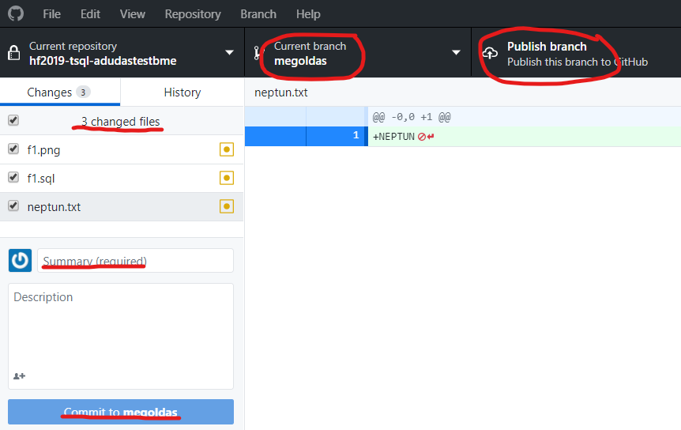
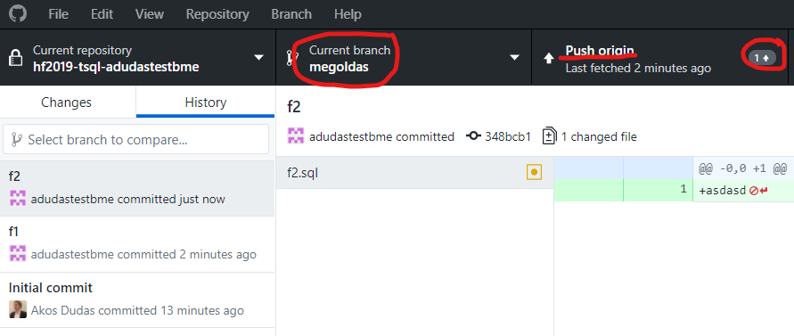
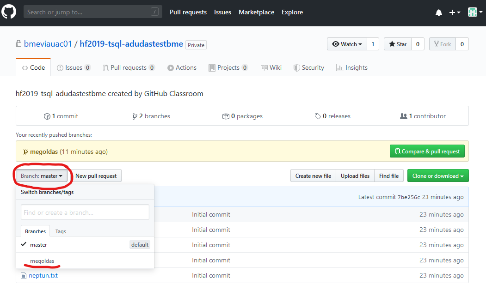
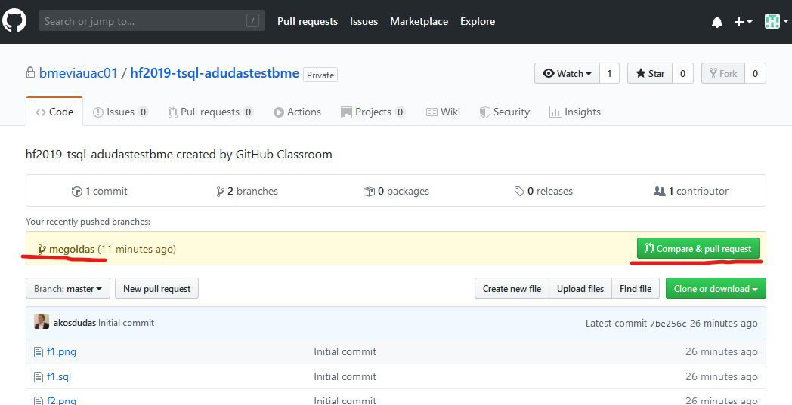
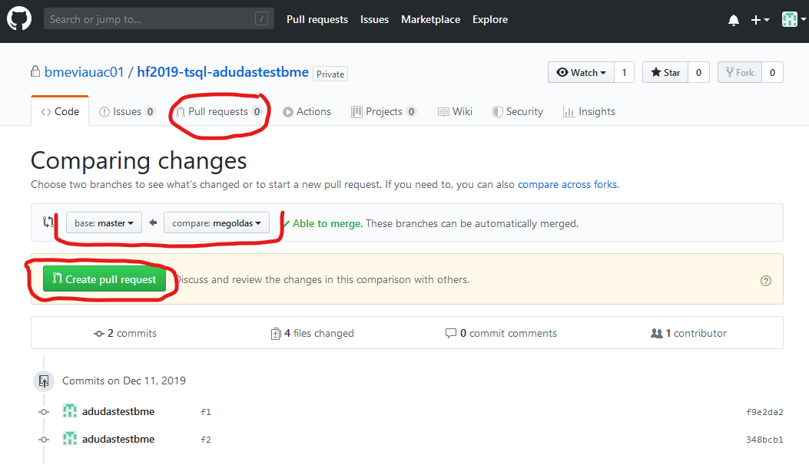
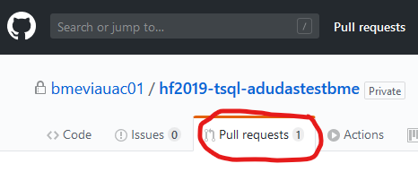
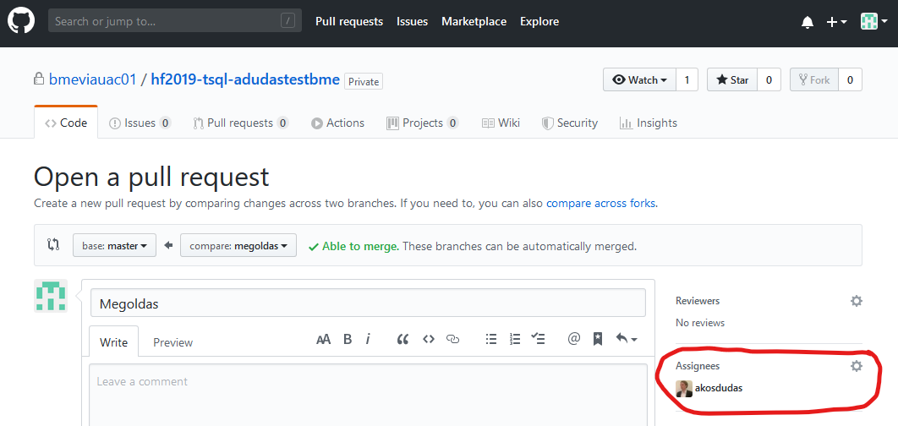
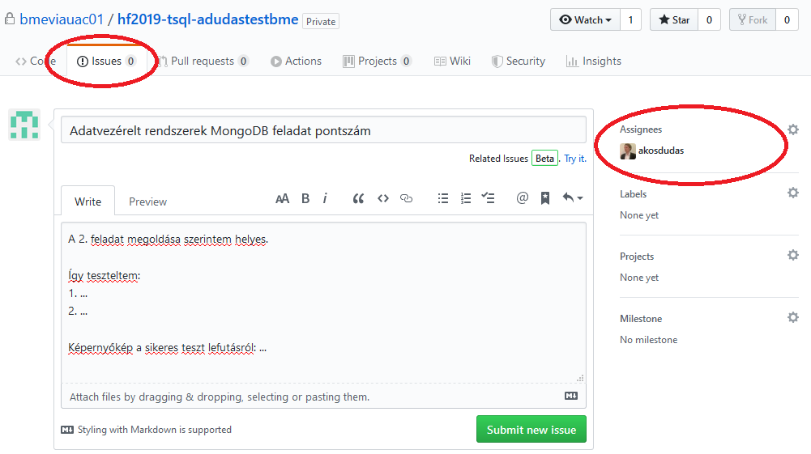

# Feladatok beadása

A feladatok beadásához a GitHub platformot használjuk. Minden labor beadása egy-egy GitHub repository-ban történik, melyet a feladatleírásban található linken keresztül kapsz meg. A labor feladatainak megoldását ezen repository-ban kell elkészítened, és ide kell feltöltened. A kész megoldás beadása a repository-ba való feltöltés után egy un. _pull request_ formájában történik, amelyet a laborvezetődhöz rendelsz.

> **FONTOS** Az itt leírt formai előírások betartása elvárás. A nem ilyen formában beadott megoldásokat nem értékeljük.

## Rövidített verzió

Alább részletesen bemutatjuk a beadás menetét. Itt egy rövid összefoglaló az áttekintéshez, illetve a helyes beadás ellenőrzéséhez.

1. A munkádat a labor anyagban található linken keresztül létrehozott GitHub repository-ban kell elkészítsd.

1. A megoldáshoz készíts egy külön ágat, ne a master-en dolgozz. Erre az ágra akárhány kommitot tehetsz. Mindenképpen pushold a megoldást.

1. A beadást egy pull request jelzi, amely pull request-et a laborvezetődhöz kell rendelned.

## A munka elkezdése: git checkout

1. [Regisztrálj](https://github.com/join) egy GitHub accountot, ha még nincs.

1. A feladat beadásához tartozó linket nyisd meg. Ez minden feladathoz más lesz, a feladat leírásában találod.

1. Ha kéri, adj engedélyt a _GitHub Classroom_ alkalmazásnak, hogy használja az account adataidat.

   

1. Látni fogsz egy oldalt, ahol elfogadhatod a feladatot ("Accept the ... assignment"). Kattints a gombra.

   

1. Várd meg, amíg elkészül a repository. A repository linkjét itt kapod meg.

   > A repository privát lesz, azaz az senki nem látja, csak te, és az oktatók.

   

1. Nyisd meg a repository-t a webes felületen a linkre kattintva. Ezt az URL-t írd fel, vagy mentsd el.

   

1. Klónozd le a repository-t. Ehhez szükséges lesz a repository címére, amit a repository webes felületén a _Clone or download_ alatt találsz.

   > A git repository kezeléséhez tetszőleges klienst használhatsz. Ha nincs kedvenced még, akkor legegyszerűbb a [GitHub Desktop](https://desktop.github.com/). Ebben az alkalmazásban közvetlenül tudod listázni a repository-kat GitHub-ról, vagy használhatod az URL-t is a klónozáshoz.

   

   Ha konzolt használnál, az alábbi parancs klónozza a repository-t (ha a `git` parancs elérhető): `git clone <repository link>`

1. Ha sikerült a klónozás, **MÉG NE KEZDJ EL DOLGOZNI!** A megoldást _ne_ a repository `master` ágán készítsd el. Hozz létre egy új ágat (branch) `megoldas` néven.

   GitHub Desktop-ban a _Branch_ menüben teheted ezt meg.

   

   Ha konzolt használsz, az új ág elkészíthető ezzel a paranccsal: `git checkout -b megoldas`

1. Ezen a megoldás ágon dolgozva készítsd el a beadandókat. Akárhányszor kommitolhatsz és pusholhatsz.

   GitHub Desktop-ban így tudsz kommitolni. Mindig ellenőrizd, hogy jó ágon vagy-e. Első alkalommal a _megoldas_ ág csak helyben létezik, ezért publikálni kell: _Publish this branch_.

   

   A további kommitoknál is mindig ellenőrizd a megfelelő ágat. Ha egy kommit még nincs felöltve, azt a _Push origin_ gombbal teheted meg. A kis szám a gombon jelzi, hogy hány, még nem pusholt kommit van.

   

   Ha konzolt használsz, akkor az alábbi parancsokat használd (feltéve, hogy a jó ágon vagy):

   ```bash
   # Ellenőrizd az ágat, és hogy milyen fájlok módosultak
   git status

   # Minden változtatást előkészít kommitolásra
   git add .

   # Kommit
   git commit -m "f1"

   # Push első alkalommal az új ág publikálásához
   git push --set-upstream origin megoldas

   # Push a továbbiakban, amikor az ág már nem új
   git push
   ```

## A megoldás beadása

1. Ha végeztél a megoldással, ellenőrizd a GitHub webes felületén, hogy mindent feltöltöttél-e. Ehhez a webes felületen váltanod kell az ágak között.

   

   > Arra kérünk, hogy **NE használd** a GitHub fájl feltöltés funkcióját. Ha valami hiányzik, a helyi git repository-ban pótold, és kommitold majd pushold.

1. Ha tényleg kész vagy, akkor nyiss egy _pull request_-et.

   > Ez a _pull request_ fogja össze a megoldásodat, és annak "végeredményét" mutatja. Így a laborvezetőnek nem az egyes kommitjaidat vagy fájljaidat kell néznie, hanem csak a releváns, változott részeket látja egyben. A _pull request_ jelenti a feladatod beadását is, így ez a lépés **nem hagyható ki**.

   A _pull request_ nyitásához a GitHub webes felületére kell menj. Itt, ha nem rég pusholtál, a GitHub fel is ajánlja a pull request létrehozását.

   

   A _pull request_-et a fenti menüben is létrehozhatod. Fontos, hogy a megfelelő brancheket válaszd ki: `master`-be megy a `megoldas` ág.

   

1. Ha minden rendben sikerült, a menüben fent látod a kis "1" számot a _Pull request_ elem mellett, jelezve, hogy van egy nyitott pull request. **DE MÉG NEM VÉGEZTÉL!**

   

1. A _pull request_ hatására le fog futni egy előzetes értékelés. Ennek eredényét a pull request alatt kommentben fogod látni.

   

   > Ez az értékelés minden labor esetében más lesz. Az értékelés eltarthat egy ideig, ne aggódj.

1. Ha nem vagy megelégedve a munkáddal, akkor még javíthatsz rajta. Ehhez kommitolj és pusholj újra. Ha továbbra is a megfelelő ágon dolgozol, akkor a _pull request_ újból le fogja futtatni a kiértékelést. Arra kérünk, hogy **MAXIMUM 5 alkalommal** futtasd le a kiértékelést!

   > Ha úgy látod, hogy a megoldásodat még javítani akarod, és nem szeretnéd, hogy mindig lefusson az értékelés, akkor **zárd le** a pull request-et a webes felületen. Ha kész vagy, nyiss majd egy újat.

1. **VÉGEZETÜL**, ha kész vagy, a _pull request_-et rendeld a laborvezetődhöz. Ez a lépés feltétlenül fontos, ez jelzi a beadást.

   

   > Ha nincs pull request-et, vagy van, de nincs a laborvezetőhöz rendelve, akkor úgy tekintjük, hogy még nem vagy készen, és nem adtad be a megoldást.

1. Most végeztél. Miután a laborvezetőhöz rendelted a pull request-et, már **ne módosíts** semmin. A laborvezető értékelni fogja a munkádat, és a pull request lezárásával kommentben jelzi a végeredményt.

## Kapott eredménnyel kapcsolatban kérdés vagy reklamáció

Ha kiértékeltük a feladatokat, és az eredménnyel kapcsolatban kérdést tennél fel, vagy reklamálnál, használd a GitHub Issue kezelését ennek jelzésére. Ebben az esetben a bizonyítás téged terhel, azaz alá kell támasztanod a reklamációt vagy kérdést (pl. annak leírásával, hogyan tesztelted a megoldásod, és mi bizonyítja a helyességét). Ha ezt nem teszed meg, figyelmen kívül fogjuk hagyni a reklamációt.

A kérdéshez vagy reklamációhoz nyiss egy új issue-t:

1. Menj a GitHub webes felületén a megoldásodat tartalmazó repository-hoz.

1. Az "Issues" fülre kattintva hozz létre egy új issue-t.

1. Írd le, hogy mi a problémád. Pontosan add meg, hogy mivel nem értesz egyet, és hogyan ellenőrizted a megoldásod.

1. Az issue-t rendeld a laborvezetődhöz.

   

Amint megnéztük a problémát, itt fogunk visszajelzést is adni.

## Lehetséges problémák és megoldásuk

Ha valami problémád akad, az alábbiak próbálnak segíteni ebben.

Ha elakadtál, és az alábbiak se segítenek, először magad próbálj megoldást keresni. A laborvezetők is állnak rendelkezésre, de ha olyan problémával keresed őket, ami a leírásban egyértelműen szerepel, akkor a segítséget mínusz pontért adjuk csak meg.

#### Nem találod a repository-t

Menj a www.github.com címre, jelentkezz be és a kezdőoldalon bal oldalon látod a repository listádat.

#### Kapsz egy "run failed" emailt / a pull request azt mondja, hogy "checks have failed"

Minden kommit után lefuttatunk pár egyszerű ellenőrzést. Ez az email arról tájékoztat, hogy nem sikerültek a tesztek. Ezeket mindenképpen javítanod kell. Ha email kaptál, abban találsz egy "View results" linket. Ha a pull request-et nézed, akkor a hiba szöveg alatt lesz egy "Details" link. Itt láthatod a futtatás pontos menetét. Ahol piros X-et látsz, ott nézelődj.

#### Nem tudod, mi a hiba a megoldásodban

Nem feltétlenül célunk a hiba pontos azonosítása számodra. A mérnöki munka része, hogy a feladataidat magad ellenőrzöd. A kiértékelés jó esetben mond valami féle irányt, de nem fogja megmondani a pontos problémát.

#### A hiba fura szöveg, nem érted

Ez akkor fordulhat elő, ha a lefuttatott C# vagy SQL kódban hiba van. A szöveg a hibaüzenet.

#### Elfelejtetted branch-et létrehozni / nem tudod a pull request-et létrehozni

Ha nem hoztad létre az ágat a megoldásnak, vagy túl későn hoztad létre, bajban leszel a pull request-tel. Pull request-et csak két olyan ág között lehet nyitni, amelyek eltérnek. Kövesd az alábbi lépéseket.

1. Hozd létre az új ágat. Válts erre az ágra.
1. Kell, hogy legyen valami változás ezen az ágon. Szerkessz bele egy fájlba egy olyan változást, ami nem módosít érdemben a tartalmon. Pl. egy újsort tegyél bele, vagy egy kommentet. Esetleg hozz létre egy új fájlt.
1. Ezt a módosítást kommitold és pushold. Ez a megoldásod ágára kell kerüljön.
1. Pushold fel az ágat.
1. Most nyiss pull request-et. A pull request-ben megjegyzésbe jelezd, hogy a pull request kerülőúton készült.

Amennyiben ezen pull request értékelése a laborvezető számára nehezebb lesz, akkor ezért pontot vonhat le (max -3 pont).

#### Nem tudod a laborvezetőd GitHub nevét

A laborvezetőd GitHub nevét a laboron el kell mondja, ezt írd fel. Ha valami oknál fogva nem tudod, ki a laborvezetőd, akkor rendeld `akosdudas`-hoz a pull request-et. Ezt a kis kitérőt, ha nem a laborvezetőd hibájából történt, akkor -3 ponttal jutalmazzuk.

#### Elkészítetted a megoldásod, de nem kaptál értékelést / pontot / jegyet

Kommitoltál? Pusholtál? Készítettél pull request-et? Hozzárendelted a laborvezetőhöz?

## Mit NE csinálj

Ha a git és a pull request-ek ismerősnek számítanak, akkor eszedbe juthatnak az alábbi opciók. Arra kérünk, hogy ezeket **NE HASZNÁLD**, mert visszaélésnek tekintjük őket.

- **NE** force pusholj
- **NE** nyúlj bele a kiértékelést leíró yaml fájlokba
- **NE** branchelj és mergelj, nincs rá szükség, csak egy megoldás ág legyen
- **NE** mergeld a pull requestet, nem arra használjuk
- **NE** törölj semmit a pull request kommentjei közül
