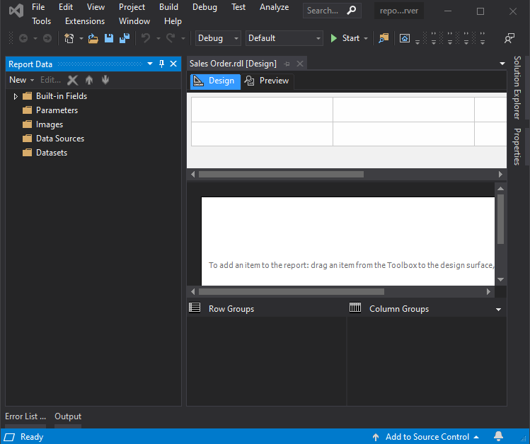
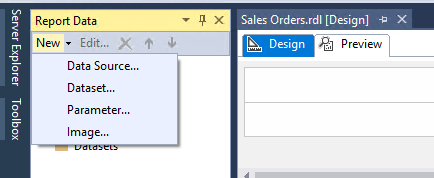
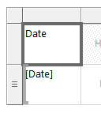
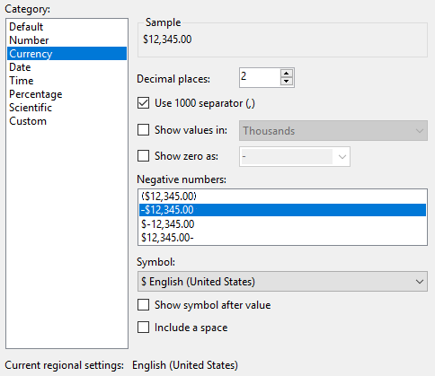
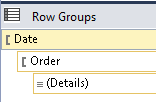
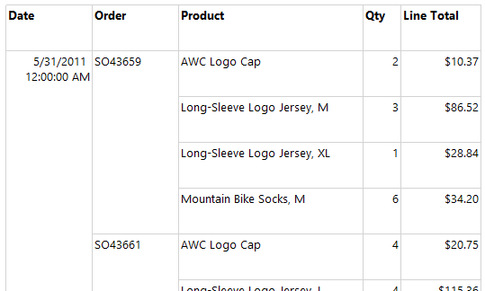
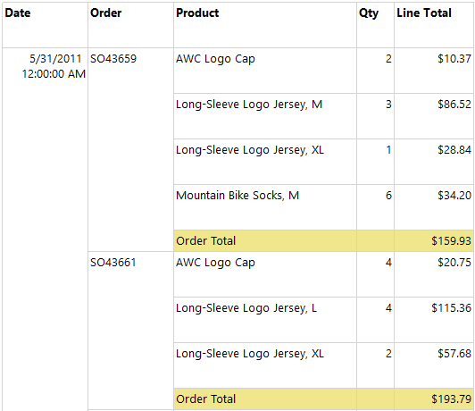
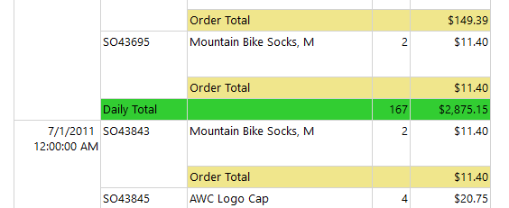

# Feladat 1: Táblázatos riport

Nyisd meg a checkoutolt git repository-ban a `reportserver.sln` fájlt. Ez egy üres _Report Server_ típusú projekt, amelyet Visual Studio-ban fejlesztünk.

A Report Server projekt elsősorban úgynevezett _Report Definition_ (.rdl) fájlokból áll, amelyek definiálják a riport előállításához szükséges adatforrásokat (lekérdezéseket), és a kinézet sablonját, amit adatokkal feltöltve kapjuk az eredmény riportot. A neve onnan ered, hogy ezeket a riportokat természetesen nem csak a fejlesztői gépen lehet lefuttatni, hanem egy _Report Server_-re telepíthetőek, ahonnan a vállalat megfelelő üzleti szereplői mindig friss riportokat kérhetnek, az aktuális adatok alapján.

## Hozzuk létre az első Report Definition fájlt.

1. _Solution Explorer_-ben jobb klikk a _Reports_-ra és _Add_ > _New Item_.

   

1. A sablonok közül válasszuk a Report lehetőséget. Nevezzük el _Sales Orders.rdl_-nek, majd nyomjunk rá az Add-re. Ekkor megnyílik a Report Designer, ahol az új .rdl fájlt láthatjuk Design nézetben.

   

A Report Designer a fejlesztőfelületünk. Két nézete van: _Design_ és _Preview_. Emellett a Report Data panel is megnyílik, itt lehet definiálni az adatforrásokat. Ha megvagyunk az adatforrások megadásával, a Design fülön tudjuk a riportot vizuálisan megtervezni, majd ha már kellőképpen előrehaladtunk a riport készítésével, a _Preview_ fülön tudjuk kipróbálni.

## Adatforrás (data source) beállítása

Az adatforrás definálja, a riport adatai honnan származnak. A mi esetünkben ez a korábban lérehozott SQL Server adatbázis lesz.

1. A _Report Data_ panelen _New_ > _Data Source_. A neve legyen "AdventureWorks2014".

   

1. A megjelenő űrlapon válasszuk a _Microsoft SQL Server_ típust és a _connection string_ mező melletti gombra kattintva adjuk meg ismét az adatbázis elérését

   - Server name: `(localdb)\mssqllocaldb`
   - Authentication: `Windows Authentication`
   - Select or enter database name: `AdventureWorks2014`

1. OK-ézzuk le a dialógusokat. Majd nyissuk meg újra a Data Source tulajdonságait (jobb egérrel és _Data Source Properties_), és ellenőrizzük a Credentials fület, mert a Visual Studio néha "elfelejti" a beállítást. Az alábbi checkbox-nak kell kijelölve lennie:

   

## Adathalmaz (data set) megadása

Ahhoz, hogy riportokat készíthessük, az adatforráshoz adathalmazokat (dataset) is meg kell adnunk. Ez gyakorlatilag egy lekérdezést fog jelenteni az adatforrás felé.

1. A _Report Data_ panelen válasszuk a _New_ > _Dataset_ opciót. Nevezzük el a satasetet "AdventureWorksDataset"-nek. Data source-ot legördülő menüből tudunk választani, használjuk az előzőleg elészítettet, és alkalmazzuk az alábbi beállításokat:

   

1. Írjuk be a következő Query-t.

   ```sql
   SELECT
     soh.OrderDate AS [Date],
     soh.SalesOrderNumber AS [Order],
     pps.Name AS Subcat, pp.Name as Product,
     SUM(sd.OrderQty) AS Qty,
     SUM(sd.LineTotal) AS LineTotal
   FROM Sales.SalesPerson sp
     INNER JOIN Sales.SalesOrderHeader AS soh
         ON sp.BusinessEntityID = soh.SalesPersonID
     INNER JOIN Sales.SalesOrderDetail AS sd
         ON sd.SalesOrderID = soh.SalesOrderID
     INNER JOIN Production.Product AS pp
         ON sd.ProductID = pp.ProductID
     INNER JOIN Production.ProductSubcategory AS pps
         ON pp.ProductSubcategoryID = pps.ProductSubcategoryID
     INNER JOIN Production.ProductCategory AS ppc
         ON ppc.ProductCategoryID = pps.ProductCategoryID
   GROUP BY ppc.Name, soh.OrderDate, soh.SalesOrderNumber,
            pps.Name, pp.Name, soh.SalesPersonID
   HAVING ppc.Name = 'Clothing'
   ```

   Ha megvagyunk, nyomjuk meg a _Refresh fields_ gombot.

   > Megjegyzés: a query-t elvileg vizuálisan is összekattinthattuk volna (a Query Designer segítségével), de az a felület elég ódon, és lassan is töltődik be.

   A többi fülön most nincs dolgunk, kattintsunk az OK-ra.

## Táblázatos riport készítése (5p)

Most, hogy megvan a kapcsolatunk az adatbázis felé, és a lekérdezést is megírtuk, elkezdhetünk riportokat gyártani. A riport nem más, mint a lekérdezés eredménye megjelenítve táblázatokban, diagramokban.

1. Nyissuk meg a _Toolbox_ panelt, ha még nem látszana (_View_ menüben megtalálható).

1. Válasszuk ki a _Table_ eszközt, majd a Design fül középső részén elhelyezkedő üres, fehér téglalapra "rajzoljunk" egy táblázatot, mintha csak egy négyszöget rajzolnánk Paintben:

   

1. Váltsunk vissza a Report Data panelre, és nyissuk le az AdventureWorksDataset-et.

   

   > Megjegyzés: ha ez üres vagy nem nyitható le, általában az a baj, hogy a dataset létrehozásakor nem nyomtuk meg a _Refresh Fields_ gombot. Ezt még nem késő megtenni: jobb kattintás a dataseten > _Dataset properties_, majd a megjelenő ablakban nyomjuk meg a _Refresh Fields_ gombot.

1. A _Date_ mezőt húzzuk rá az imént "rajzolt" táblázat első oszlopára. Ilyesmi eredményt kell kapjunk:

   

   > Megjegyzés: a második sorban látható \[Date\] jelöli a kiértékelendő kifejezést, míg az eső sorban látható "Date" felirat lesz az oszlop fejléce a riportban – ez utóbbit át is írhatjuk.

1. Az előbbi módszerrel húzzuk be a második oszlopba az _Order_, a harmadikba a _Product_ mezőt. A _Qty_ mezőt is húzzuk be, de a jobb szélső oszlop szélére, úgy, hogy felengedés előtt egy + jelet lássunk az egérkurzor alatt, és egy függőleges kék vonalat a táblázat szélén. Így egy új, negyedik oszlopba fog kerülni a mező. Ugyanígy eljárva húzzuk be a _LineTotal_ mezőt is ötödik oszlopnak.

   

1. Ezzel el is készült az első riportunk. Nézzük meg a Preview fülön. Elsőre kicsit lassan töltődik be, erre számítsunk. A továbbiakban már gyorsabb lesz!

   

   Az elkészült riportot például kinyomtathatjuk, vagy exportálhatjuk több féle formátumba (Word, Excel, PowerPoint, PDF…). Jelen állapotában azért van rajta még mit csiszolni, pl. a végösszeg mezőnél nincs jelölve a valuta, és az értéket is bőven elég lenne 2 tizedesjelre kerekítve megmutatni. A dátum formázása és az oszlopok szélessége sem az igazi.

1. Menjünk vissza a _Design_ fülre, és kattintsunk jobb egérgombbal a \[Date\] kifejezésen, majd válasszuk a _Text Box Properties_ opciót. Itt a _Number_ fülön válasszuk a _Date_ kategóriát, és válasszunk ki egy szimpatikus dátumformátumot.

   

1. A \[LineTotal\] kifejezésen jobb klikkelve, az előbbivel analóg módon, a _Text Box Properties_-t kiválasztva történik, csak a _Currency_ kategóriát kell választani a _Number_ fülön.

   

1. A táblázat fejléc sor fölötti szürke téglalapok szélei fölé mozgatva az egeret a szokásos átméretező kurzor ikonokkal találkozhatunk. (Kb. mintha Excelben vagy Wordben próbálnánk táblázatot méretezni.) Ennek segítségével méretezzük át kicsit szélesebbre a táblázatot, és esetleg vegyük szűkebbre a _Qty_ és _Line Total_ oszlopokat a többihez képest.

   Végül vastagítsuk ki a fejléc sor feliratait. Ehhez jelöljük ki a teljes sort a bal szélén található szürke négyzetre kattintva, majd a fenti eszköztáron kattintsunk a _Bold_ gombra

   

   Ha ránézünk a Preview fülre, ilyesmit kell látnunk:

   

1. Készíts egy képernyőképet a riport előnézetéről. (A képernyőképpel kapcsolatos elvárásokról lásd a kezdőoldalon.)

   > A képet a megoldásban `f1-table.png` néven add be. A képernyőképen a Visual Studio ablaka, és azon belül a riport előnézete látszódjon.
   >
   > A képernyőkép szükséges feltétele a feladat teljesítésének.

## Csoportosítás és összegzés (5p)

A riport jelenleg ömlesztve tartalmazza az adatokat. Ezek eladási adatok, adott termékekből adott napon eladott mennyiség. Rendezzük csoportokba az adatokat.

1. Térjünk vissza a _Design_ fülre. Győződjünk meg róla, hogy a táblázatunk alatt látjuk a _Row Groups_ panelt – ha nem lenne ott, jobb klikkeljünk a dizájn felületen, és a _View_ menüben pipáljuk ki a _Grouping_ opciót.

1. A _Report Data_ panelről húzzuk a _Date_ mezőt a _Row Groups_ panelre, azon belül is a _(Details)_ sor fölé.

   

   A táblázatunk megjelenése a következőképpen fog változni:

   

1. Húzzuk az _Order_ mezőt is a _Row Groups_ panelre, **a _Date_ és a _(Details)_ közé**.

   

1. A csoportként megadott elemeknek automatikusan létrehozott oszlopokat a táblázatban a rendszer. Mivel már korábban is felvettük őket, ezért most kétszer is szerepelnek; töröljük őket. A felettük található szürke téglalapra kattintva jelöljük ki a **jobb oldali** _Date_ és _Order_ oszlopokat, és töröljük ki őket (jobb kattintás és _Delete Columns_).

   

   Ha most megnézzük a _Preview_ fület, láthatjuk, hogy az általunk megadott
   szempontok szerint (és az általunk megadott sorrendben) csoportosításra
   kerülnek a riport sorai

   

   > Megjegyzés: Az új _Date_ oszlop formátuma ezzel visszaállt az eredeti formátumra, de a _Text Style Properties_ segítségével újra be tudjuk állítani.)

1. Váltsunk vissza _Design_ nézetre. Kattintsunk jobb egérgombbal a \[LineTotal\] cellára, és válasszuk az _Add Total_ opciót. Ezzel az egyes _Order_-ekhez (amik mentén csoportosítottunk) meg fog jelenni a rendelések összege. Ehhez alapból nem rendelődik címke, de beírhatunk egyet: csak bal gombbal kattintsunk a megfelelő üres cellába, és írjuk be: "Order Total"

   

1. CTRL billentyűt nyomva tartva kattintsunk az _Order Total_ cellájára, majd a tőle jobbra levő két cellára is, hogy kijelöljük őket, és a _Format_ menüből válasszunk új háttérszínt nekik.

   

1. Az eredményt szokás szerint megnézhetjük a _Preview_ fülön:

   

1. Készítsünk napi összegzést is!

   - Váltsunk vissza _Design_ nézetre
   - Jobb klikk az \[Order\] cellán, válasszuk az _Add Total_ > _After_ lehetőséget.
   - Az \[Order\] cella alatt megjelenik egy "Total" feliratú cella. Kattintsunk bele, és írjuk át "Daily Total"-ra.
   - Válasszuk ki ezt a cellát, és mellette a másik hármat (pl. a CTRL nyomvatartása mellett végigkattintgatva őket), majd adjunk nekik valamilyen háttérszínt (_Format_ > _Background color_).

1. Mivel az adatbázisban egy naphoz nagyon sok megrendelés is tartozhat, a _Preview_ fülön akár 4-5 oldalt is le kell görgetni, mire megpillantjuk munkánk gyümölcsét:

   

1. Zárásként végösszeget is készíthetünk. Mivel ez nagyon hasonló az előző
   feladathoz, ezt is megpróbálhatjuk a hallgatókra bízni. Megoldás:

   - Jobb klikk a \[Date\] cellán, _Add Total_ > _After_
   - A \[Date\] alatti "Total" cella feliratát írjuk át pl. "Grand Total"-ra
   - Jelöljük ki a "Grand Total" cellát és a mellette levőket, és színezzük át őket a _Format_ > _Background color_ opcióval.

1. A _Preview_ fülön ez értelemszerűen csak a riport legvégén fog megjelenni. Használjuk a nézegetőben a _Last page_  gombot.

1. Készíts egy képernyőképet a riport előnézetéről. (A képernyőképpel kapcsolatos elvárásokról lásd a kezdőoldalon.)

   > A képet a megoldásban `f1-grouptotal.png` néven add be. A képernyőképen a Visual Studio ablaka, és azon belül a riport előnézete látszódjon. Látszódjon legalább egy összegző sor a nézetben.
   >
   > A képernyőkép szükséges feltétele a feladat teljesítésének.

## Következő feladat

Folytasd a [következő feladattal](Feladat-2.md).
